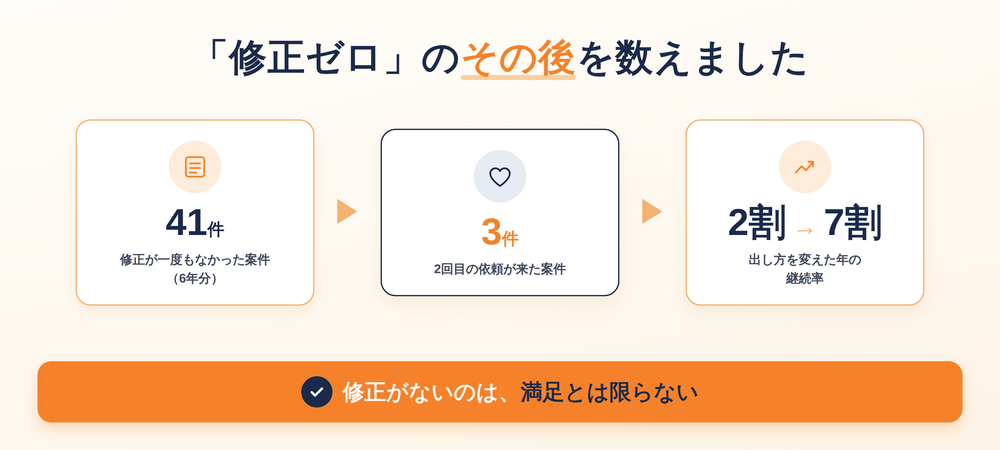
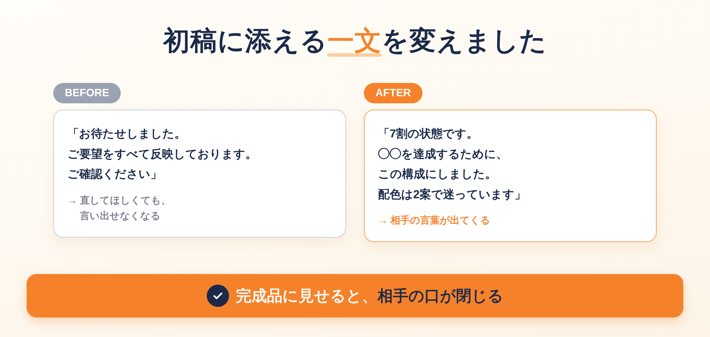
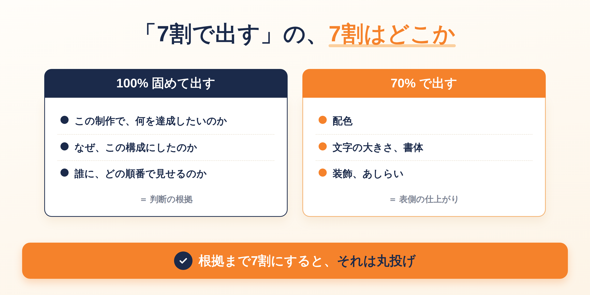
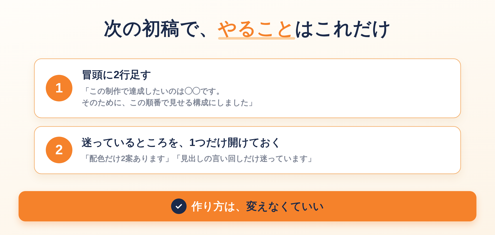

「もう二度と、依頼しません」

納品の3日後、クライアントからそう届きました。4週間かけたLPでした。配色も余白も文字の大きさも、深夜2時まで調整して。**修正は、一度もありませんでした。**

納品したときは「完璧です！ありがとうございます」と、絵文字つきで返ってきていたんです。

意味が分からなくて、震える指で「何かご迷惑をおかけしましたか」と送りました。返ってきたのは、デザインの話ではありませんでした。

修正が少ないのは、いいことだと思っていました。丁寧に作って、一発で通る。それが腕の証明だと。

でも、6年分の案件を数えてみたら、逆のことが起きていました。

この記事に書くのは、**「修正ゼロ」が何を隠していたのか**と、初稿の出し方をどう変えたのかです。

今日ぜんぶ変えなくて大丈夫です。次の初稿に2行足すところまで、一緒に行きます。

## 「完璧です」は、合格点ではありませんでした

### 口を出せないものを、4週間かけて作っていた

理由を聞いたとき、その方は少し間をおいて、こう言いました。

「完璧すぎて、私の入る隙がなかったんです」

初稿を見た瞬間に「あ、もう完成してる」と思った。直してほしいところが2つあったけれど、こんなに作り込まれているものに口を出したら悪いと思って、言えなかった。だから「完璧です」と返した。

そして、最後にこう続きました。

「でも、自分の商品なのに、自分では何も決めていない気がして」

画面を見たまま、しばらく動けませんでした。

私は4週間かけて、**その人が口を出せないもの**を作っていたんです。

### 「文句がない」と「また頼みたい」は、別のこと

このとき初めて分かりました。

修正がないのは、満足だからとは限りません。**言いにくかっただけ**のことがあります。

そして、言えなかった人は、文句を言わずに次から来なくなります。

> まずはここだけで大丈夫です。「修正ゼロ」は、評価ではなく症状かもしれない。



## 修正ゼロの案件を、6年分数えてみました

怖かったのですが、過去の案件を全部開きました。

修正が一度もなかった案件は、**41件**。そのうち2回目の依頼が来たのは、**3件**でした。

一方で、修正のやりとりが何往復かあった案件のほうが、継続につながっていました。

数字を見るまで、私は完全に逆の理解をしていたんです。「手がかからない仕事ほど良い仕事」だと思っていました。

実際は、**相手が関われなかった仕事**でした。

### デザインに限った話ではありません

これは、自分の商品を持っている方にも起きます。

提案書を完璧に作り込んで送る。セミナーの内容を一分の隙もなく固めて出す。相手は「すごいですね」と言う。でも、申し込みは来ない。

**完成度が高すぎると、相手は「自分が必要ない」と感じます。**

> 今日のゴールは、思い当たる案件を1つ思い出すところまでで十分です。

## 初稿に添えていた一文が、相手の口を閉じさせていた

初稿を出すとき、私はいつもこう書いていました。

「お待たせしました。ご要望をすべて反映しております。ご確認ください」

丁寧なつもりでした。でも相手から見ると、ほとんどこう書いてあるのと同じです。

**「こちらが完成品です。文句ありますか？」**

「すべて反映しております」と言われたあとに、「ここ違います」とは言いにくい。しかも深夜まで調整したことが伝わる仕上がりなら、なおさらです。

私は、相手に気を遣わせる文章を、毎回自分で添えていました。



## 「7割で出す」の、7割はどこか

ここが、この記事でいちばん伝えたいところです。

初稿を7割で出す話をしたとき、こんな質問をいただきました。

> 7割で出すと、クライアントが迷走することもあるのでは。知見やゴールを持っていない相手だと、7割では想像できず、一周まわってしまう。

**そのとおりだと思いました。** 私も一度、これで失敗しています。

ラフだけ出して「どうですか」と聞いたら、相手が決められなくなって、打ち合わせが3回増えました。

### 固めるところと、開けておくところは違う

整理すると、こうです。

私が「7割」と言っているのは、**表側の仕上がり**のことです。判断の根拠のほうは、7割ではなく、固めて出します。

**100%固めて出すもの**

- この制作で、何を達成したいのか
- なぜこの構成にしたのか
- 誰に、どの順番で見せるのか

**70%で出すもの**

- 配色
- 文字の大きさ、書体
- 装飾、あしらい

根拠が固まっていない状態で見た目だけラフに出すのは、7割ではなく**丸投げ**です。相手が迷走するのは、こちらのときです。



### 添える言葉も変えました

今は、こう書いて出します。

「7割の状態です。◯◯を達成するために、この順番で見せる構成にしました。配色は2案で迷っています。どちらがしっくりきますか？」

**目的と構成は言い切る。選ぶところだけ渡す。**

これに変えてから、「こっちが好きです」「ここの言葉をもう少し柔らかく」と、相手の言葉が出てくるようになりました。

修正は増えました。でも、その年の継続率は2割から7割になりました。

> まだ全部を変えなくて大丈夫です。「迷っているところ」を1つ書くだけでも、相手の口は開きます。

## 1案で出すか、何案か出すか

これも、いただいた質問です。

> 至高の1案だけを出す人と、何案か出して選んでもらう人がいるが、実際どちらがいいのか。

私の答えは、**数の問題ではない**です。

3案出しても、3案とも「きれいさ」の違いしかなければ、相手は好みでしか選べません。好みで選んだものは、あとから必ず揺れます。

逆に1案でも、「なぜこの構成にしたか」が添えてあれば、相手は判断できます。

つまり、**選んでもらうべきなのは案ではなく、判断の分かれ目**です。

「文字を大きくして読みやすさを優先するか、余白を取って高級感を優先するか」。これなら、相手は自分の商売の言葉で答えられます。

### 構成だけ先に見せる、は正解に近い

もう一つ、こんな声もいただきました。

> 最初に構成やファーストビューだけ見せて、「この方向性で違和感ないですか」と確認するほうが、お互い安心では。

これは、私が6年かけてたどり着いたやり方と、ほとんど同じです。

先に見せるのが「構成」なのがポイントです。構成は、見た目の好みではなく**目的の話**なので、相手が答えやすい。ここで合意が取れていれば、あとの修正は細部だけで済みます。

## 今日からできること

### 次の初稿に、2行足すだけ

```
この制作で達成したいのは、◯◯です。
そのために、この順番で見せる構成にしました。
```

これを初稿の冒頭に書くだけで、相手の反応が変わります。**作り方を変える必要はありません。**

### 迷っているところを、1つだけ開けておく

全部を迷う必要はありません。1か所で十分です。

「配色だけ2案あります」「見出しの言い回しだけ迷っています」。

この1か所が、相手の入り口になります。



## おわりに

「もう二度と」と言ってくれたあの方は、その後3年、正規の金額で続けてくださっています。

言わずに離れていく人がほとんどの中で、理由を教えてくれた。あれは、最後に届いた親切でした。

もし今、修正ゼロで納品できているのに、なぜか2回目が来ないなら。

たぶん、上手すぎるだけです。

---

「自分の場合、どこを固めて、どこを開けておけばいいのか分からない」という方へ。

LINEで、個別ロードマップ作成会をご案内しています。今の進め方を一緒に見ながら、次の1件までの順番を整理します。よかったら覗いてみてください。
